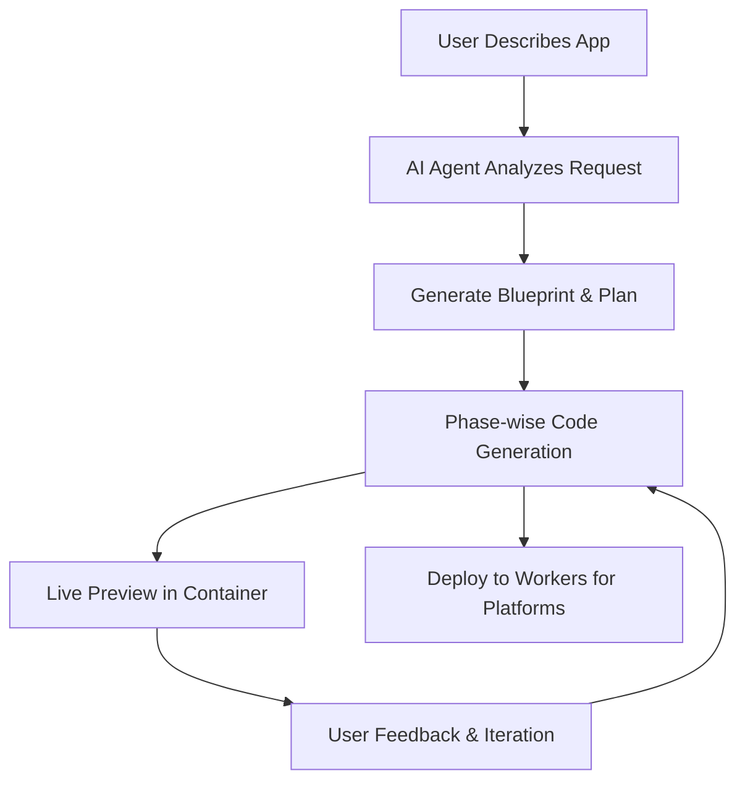

# 🧡 Cloudflare Orange Build

> **An open source full-stack AI webapp generator** – Deploy your own instance of Cloudflare Orange Build, an alternative to platforms like Lovable, V0, and Bolt that you can run and customize yourself.

<div align="center">

**🌟 [Try the Live Demo](https://build.cloudflare.dev) 🌟**

*See Orange Build in action before deploying your own instance*

[](https://deploy.workers.cloudflare.com/?url=https://github.com/AshishKumar4/cloudflare-orange-build)

**👆 Click to deploy your own instance!**

*Follow the setup guide below to configure required services*

</div>

---

## 📚 Table of Contents

### Quick Start
- [🚀 Deploy to Cloudflare](#-deploy-to-cloudflare)
- [⚙️ Required Configuration](#️-required-configuration)
- [📋 Configuration Checklist](#-configuration-checklist)

### Platform Overview
- [✨ What is Cloudflare Orange Build?](#-what-is-cloudflare-orange-build)
- [💡 Try These Example Prompts](#-try-these-example-prompts)
- [🎨 How It Works](#-how-it-works)

### Architecture & Features
- [🌍 Architecture Deep Dive](#-architecture-deep-dive)
- [🎯 Perfect For](#-perfect-for)
- [📊 System Requirements](#-system-requirements)

### Development & Management
- [🏠 Local Development](#-local-development)
- [🗑️ Undeployment Guide](#️-undeployment-guide)
- [🔐 Complete Secrets & Variables Reference](#-complete-secrets--variables-reference)

### Support & Community
- [❓ Troubleshooting](#-troubleshooting)
- [🔒 Security & Privacy](#-security--privacy)
- [🤝 Contributing](#-contributing)
- [📚 Resources](#-resources)

---

## 🚀 Deploy to Cloudflare

Deploy your own Cloudflare Orange Build instance. The process takes about 5 minutes with proper setup:

**Step 1: Click Deploy Button** 🔗  
Click the deploy button above to start the process

**Step 2: Connect Git Account** ☁️  
Connect your GitHub/Gitlab account to Cloudflare  

**Step 3: Configure Services** ⚙️  
You'll be prompted to configure the required services below

**Step 4: Deploy** 🚀  
Once configured, deployment happens automatically

---

## ⚙️ Configuration Guide

When you click "Deploy to Cloudflare", you'll be taken to your Cloudflare dashboard where you can configure your Orange Build deployment:

### 📝 What You'll See on the Deploy Page

The deployment page will show you several sections to configure:

1. **Resource Names** - Default names for D1 database, R2 buckets, Worker, and KV storage (pre-filled)
2. **Worker Secrets** - Encrypted variables for your deployed app
3. **Environment Variables** - Configuration from wrangler.jsonc (pre-filled)
4. **Build Commands** - Should be set to `bun run build` and `bun run deploy`
5. **Build Variables** - Optional variables available during deployment

### 🔑 Essential Configuration

#### Worker Secrets (Required)
These secrets will be shown on the deploy page and are **required** for the platform to work:

- `CLOUDFLARE_AI_GATEWAY_TOKEN` - Your AI Gateway token (see AI Gateway section below)
- `ANTHROPIC_API_KEY` - Your Anthropic API key for Claude models
- `OPENAI_API_KEY` - Your OpenAI API key for GPT models  
- `GEMINI_API_KEY` - Your Google Gemini API key for Gemini models
- `JWT_SECRET` - Secure random string for session management (use default: `default`)
- `WEBHOOK_SECRET` - Webhook authentication secret (use default: `default`)

#### Build Variables (Highly Recommended)
In the "Build Variables" dropdown, add:

- `CLOUDFLARE_AI_GATEWAY_TOKEN` - **Same token as above** (needed for automatic AI Gateway creation)
- `SANDBOX_INSTANCE_TYPE` - Container performance tier (optional, see section below)

> **💡 Why Both Places?** The AI Gateway token is needed in **both** Worker Secrets (for runtime) and Build Variables (for automatic setup during deployment).

### 🤖 AI Gateway Setup Options

#### Option A: Automatic Setup (Recommended) ✅
1. Get an AI Gateway token with **Read, Edit, and Run** permissions:
   - Go to [AI Gateway Dashboard](https://dash.cloudflare.com/ai/ai-gateway)
   - Create or use existing gateway → Authentication tokens → Create token
   - Enable permissions: **Read**, **Edit**, and **Run**
2. Add this token to **both** Worker Secrets and Build Variables as `CLOUDFLARE_AI_GATEWAY_TOKEN`
3. Deploy - the AI Gateway will be created automatically! 🎉

#### Option B: Manual Setup (If you don't have a token)
1. Go to [AI Gateway Dashboard](https://dash.cloudflare.com/ai/ai-gateway)
2. Click **Create Gateway** → Name: `orange-build-gateway`
3. Enable **Authenticated Gateway** → Create authentication token
4. Add the token as `CLOUDFLARE_AI_GATEWAY_TOKEN` in Worker Secrets (and optionally Build Variables)

### 🔗 Post-Deployment: OAuth Setup (Optional)

OAuth configuration is **not** shown on the initial deploy page. If you want user login features, you'll need to set this up after deployment:

**How to Add OAuth After Deployment:**
1. **Find your repository** in your GitHub/GitLab account (created by "Deploy to Cloudflare" flow) 
2. **Clone locally** and run `bun install`
3. **Create `.dev.vars` and `.prod.vars` files** (see below for OAuth configuration)
4. **Run `bun run deploy`** to update your deployment

**Google OAuth Setup:**
1. [Google Cloud Console](https://console.cloud.google.com) → Create Project
2. Enable **Google+ API** 
3. Create **OAuth 2.0 Client ID**
4. Add authorized origins: `https://your-worker-name.workers.dev`
5. Add redirect URI: `https://your-worker-name.workers.dev/api/auth/google/callback`
6. Add to **both** `.dev.vars` (for local development) and `.prod.vars` (for deployment):
   ```bash
   GOOGLE_CLIENT_ID="your-google-client-id"
   GOOGLE_CLIENT_SECRET="your-google-client-secret"
   ```

**GitHub OAuth Setup:**
1. GitHub → **Settings** → **Developer settings** → **OAuth Apps**
2. Click **New OAuth App**
3. Application name: `Cloudflare Orange Build`
4. Homepage URL: `https://your-worker-name.workers.dev`
5. Authorization callback URL: `https://your-worker-name.workers.dev/api/auth/github/callback`
6. Add to **both** `.dev.vars` (for local development) and `.prod.vars` (for deployment):
   ```bash
   GITHUB_CLIENT_ID="your-github-client-id"
   GITHUB_CLIENT_SECRET="your-github-client-secret"
   ```

### 🏗️ 4. Sandbox Instance Configuration (Optional)

Orange Build uses Cloudflare Containers to run generated applications in isolated environments. You can configure the container performance tier based on your needs and Cloudflare plan.

#### Available Instance Types

| Instance Type | Memory | CPU | Disk | Use Case | Availability |
|---------------|--------|-----|------|----------|--------------|
| `dev` | 256 MiB | 1/16 vCPU | 2 GB | Development/testing | All plans |
| `basic` | 1 GiB | 1/4 vCPU | 4 GB | Light applications | All plans |
| `standard` | 4 GiB | 1/2 vCPU | 4 GB | Most applications | All plans (**Default**) |
| `enhanced` | 4 GiB | 4 vCPUs | 10 GB | High-performance apps | Enterprise customers only |

#### Configuration Options

**Option A: Via Deploy Button (Recommended)**
During the "Deploy to Cloudflare" flow, you can set the instance type as a **build variable**:
- Variable name: `SANDBOX_INSTANCE_TYPE`
- Recommended values:
  - **Standard/Paid users**: `standard` (default)
  - **Enterprise customers**: `enhanced`

**Option B: Via Environment Variable**
For local deployment or CI/CD, set the environment variable:
```bash
export SANDBOX_INSTANCE_TYPE=standard  # or enhanced, basic, dev
bun run deploy
```

#### Instance Type Selection Guide

**For Standard/Paid Users:**
- **`standard`** (Recommended) - Best balance of performance and resource usage
- **`basic`** - For simple applications or testing
- **`dev`** - Minimal resources for development only

**For Enterprise Customers:**
- **`enhanced`** (Recommended) - Maximum performance with full CPU cores and extra disk space
- **`standard`** - If you prefer conservative resource usage

#### What This Affects

The `SANDBOX_INSTANCE_TYPE` controls:
- **App Preview Performance** - How fast generated applications run during development
- **Build Process Speed** - Container compile and build times
- **Concurrent App Capacity** - How many apps can run simultaneously
- **Resource Availability** - Memory and disk space for complex applications

> **💡 Pro Tip**: Start with `standard` and upgrade to `enhanced` if you notice performance issues with complex applications or need faster build times.

> **⚠️ Enterprise Required**: The `enhanced` instance type requires a Cloudflare Enterprise plan. Using it on other plans may result in deployment failures.

---

## 📋 Quick Deploy Checklist

Before clicking "Deploy to Cloudflare", have these ready:

### ✅ Required API Keys
Get these API keys from each provider:
- **Anthropic API Key** - Get from [console.anthropic.com](https://console.anthropic.com)
- **OpenAI API Key** - Get from [platform.openai.com](https://platform.openai.com) 
- **Google Gemini API Key** - Get from [ai.google.dev](https://ai.google.dev)

### ✅ AI Gateway Token (Highly Recommended)
1. Go to [AI Gateway Dashboard](https://dash.cloudflare.com/ai/ai-gateway)
2. Create or use existing gateway → Authentication tokens → Create token
3. Enable permissions: **Read**, **Edit**, and **Run**
4. Copy the token - you'll add it in **both** Worker Secrets and Build Variables

### 🚀 Deploy Steps
1. **Click "Deploy to Cloudflare"** button above
2. **Configure Worker Secrets** (all required):
   - `CLOUDFLARE_AI_GATEWAY_TOKEN` - Your AI Gateway token
   - `ANTHROPIC_API_KEY` - Your Anthropic API key
   - `OPENAI_API_KEY` - Your OpenAI API key  
   - `GEMINI_API_KEY` - Your Google Gemini API key
   - `JWT_SECRET` - Use default: `default`
   - `WEBHOOK_SECRET` - Use default: `default`
3. **Add Build Variables** (recommended):
   - `CLOUDFLARE_AI_GATEWAY_TOKEN` - Same token as above
   - `SANDBOX_INSTANCE_TYPE` - `standard` (or `enhanced` for Enterprise)
4. **Verify build commands**: `bun run build` and `bun run deploy`
5. **Click Deploy** and wait for build completion

### ⚡ What Gets Created Automatically
- ✅ Cloudflare Worker with all bindings
- ✅ D1 Database with migrations
- ✅ R2 Buckets for templates and storage
- ✅ KV Storage for sessions
- ✅ AI Gateway (if token provided)
- ✅ Container instances for app previews

### 🔧 Optional: Add OAuth Later
OAuth setup is **not** shown during initial deployment. To add user login features:
1. Go to your GitHub/GitLab account and find your Orange Build repository (created by deploy flow)
2. Clone it locally and run `bun install`
3. Create `.dev.vars` file and add OAuth secrets
4. Create `.prod.vars` file and add the same OAuth secrets
5. Run `bun run deploy` to update your deployment

> **💡 Pro Tip**: Start with the AI Gateway token for the smoothest experience - it automatically sets up authentication for you!

---

## ✨ What is Cloudflare Orange Build?

Cloudflare Orange Build is an open source **text-to-app** platform built on Cloudflare's developer ecosystem. It provides an alternative to proprietary platforms like Lovable, V0, and Bolt that you can deploy and customize yourself. Describe what you want to build in plain English, and AI agents create, deploy, and iterate on complete web applications.

**🌐 [Experience it live at build.cloudflare.dev](https://build.cloudflare.dev)** – Try building apps with AI before setting up your own instance!

### 🎯 Key Features

🤖 **AI Code Generation** – Phase-wise development with intelligent error correction  
⚡ **Live Previews** – App previews running in sandboxed containers  
💬 **Interactive Chat** – Guide development through natural conversation  
📱 **Modern Stack** – Generates React + TypeScript + Tailwind apps  
🚀 **One-Click Deploy** – Deploy generated apps to Workers for Platforms  
📦 **GitHub Integration** – Export code directly to your repositories  

### 🏗️ Built on Cloudflare's Platform

Cloudflare Orange Build utilizes the full Cloudflare developer ecosystem:

- **Frontend**: React + Vite with modern UI components
- **Backend**: Workers with Durable Objects for AI agents  
- **Database**: D1 (SQLite) with Drizzle ORM
- **AI**: Multiple LLM providers via AI Gateway
- **Containers**: Sandboxed app previews and execution
- **Storage**: R2 buckets for templates, KV for sessions
- **Deployment**: Workers for Platforms with dispatch namespaces

---

## 💡 Try These Example Prompts

Want to see these prompts in action? **[Visit the live demo at build.cloudflare.dev](https://build.cloudflare.dev)** first, then try them on your own instance once deployed:

**🎮 Fun Apps**
> "Create a todo list with drag and drop and dark mode"

> "Build a simple drawing app with different brush sizes and colors"

> "Make a memory card game with emojis"

**📊 Productivity Apps**  
> "Create an expense tracker with charts and categories"

> "Build a pomodoro timer with task management"

> "Make a habit tracker with streak counters"

**🎨 Creative Tools**
> "Build a color palette generator from images"

> "Create a markdown editor with live preview"  

> "Make a meme generator with text overlays"

**🛠️ Utility Apps**
> "Create a QR code generator and scanner"

> "Build a password generator with custom options"

> "Make a URL shortener with click analytics"

---

## 🎨 How It Works



### How It Works

1. **🧠 AI Analysis**: Language models process your description
2. **📋 Blueprint Creation**: System architecture and file structure planned
3. **⚡ Phase Generation**: Code generated incrementally with dependency management
4. **🔍 Quality Assurance**: Automated linting, type checking, and error correction
5. **📱 Live Preview**: App execution in isolated Cloudflare Containers
6. **🔄 Real-time Iteration**: Chat interface enables continuous refinements
7. **🚀 One-Click Deploy**: Generated apps deploy to Workers for Platforms

---

## 🌍 Architecture Deep Dive

### Durable Objects for Stateful AI Agents
```typescript
class CodeGeneratorAgent extends DurableObject {
  async generateCode(prompt: string) {
    // Persistent state across WebSocket connections
    // Phase-wise generation with error recovery
    // Real-time progress streaming to frontend
  }
}
```

### Workers for Platforms Deployment
```javascript
// Generated apps deployed to dispatch namespace
export default {
  async fetch(request, env) {
    const appId = extractAppId(request);
    const userApp = env.DISPATCHER.get(appId);
    return await userApp.fetch(request);
  }
};
```

### Phase-wise Code Generation
Cloudflare Orange Build generates apps in intelligent phases:

1. **Planning Phase**: Analyzes requirements, creates file structure
2. **Foundation Phase**: Generates package.json, basic setup files  
3. **Core Phase**: Creates main components and logic
4. **Styling Phase**: Adds CSS and visual design
5. **Integration Phase**: Connects APIs and external services
6. **Optimization Phase**: Performance improvements and error fixes

---

## 🎯 Perfect For

### 🚀 **Rapid Prototyping**
Turn ideas into working apps quickly

### 📚 **Learning Web Development** 
See modern React patterns generated and explained in real-time

### 🏢 **Client Demos**
Create proof-of-concepts for stakeholders

### ⚡ **Hackathons**
Build and deploy complete applications efficiently

### 🔬 **Platform Exploration**
Experience Cloudflare's developer platform capabilities

---

## 📊 System Requirements

### For Users
- **Cloudflare Account** (Workers paid plan recommended for full features)
- **GitHub Account** (free)
- **Modern Browser** (Chrome 90+, Firefox 88+, Safari 14+)

### Auto-Provisioned Resources
The deploy button automatically creates:
- **D1 Database** (SQLite at the edge)
- **Durable Objects** (stateful serverless objects)
- **R2 Storage** (object storage for templates)
- **KV Storage** (key-value storage for sessions)
- **Workers AI Binding** (if enabled)
- **Dispatch Namespace** (for user app deployment)

---

## ❓ Troubleshooting

### Common Deploy Issues

**🚫 "Insufficient Permissions" Error**
- Authentication is handled automatically during deployment
- If you see this error, try redeploying - permissions are auto-granted
- Contact Cloudflare support if the issue persists

**🤖 "AI Gateway Authentication Failed"**  
- Confirm AI Gateway is set to **Authenticated** mode
- Verify the authentication token has **Run** permissions
- Check that gateway URL format is correct

**🗄️ "Database Migration Failed"**
- D1 resources may take time to provision automatically
- Wait a few minutes and retry - resource creation is handled automatically
- Check that your account has D1 access enabled

**🔐 "Missing Required Variables"**
- **Worker Secrets**: Verify all required secrets are set: `ANTHROPIC_API_KEY`, `OPENAI_API_KEY`, `GEMINI_API_KEY`, `JWT_SECRET`
- **AI Gateway Token**: `CLOUDFLARE_AI_GATEWAY_TOKEN` should be set as BOTH build variable and worker secret
- **Environment Variables**: These are automatically loaded from wrangler.jsonc - no manual setup needed
- **Authentication**: API tokens and account IDs are automatically provided by Workers Builds

**🤖 "AI Gateway Not Found"**
- **With AI Gateway Token**: The deployment script should automatically create the gateway. Check that your token has Read, Edit, and **Run** permissions.
- **Without AI Gateway Token**: You must manually create an AI Gateway before deployment:
  1. Go to [AI Gateway Dashboard](https://dash.cloudflare.com/ai/ai-gateway)
  2. Create gateway named `orange-build-gateway` (or your custom name)
  3. Enable authentication and create a token with **Run** permissions

**💡 "AI Gateway Wholesaling"**
- Users with AI Gateway Wholesaling can skip individual provider API keys
- Ensure your AI Gateway token has proper Run permissions for all providers

**🏗️ "Container Instance Type Issues"**
- **"enhanced" fails on non-Enterprise plans**: Use `standard` instead - `enhanced` requires Cloudflare Enterprise
- **Slow app previews**: Try upgrading from `dev` or `basic` to `standard` instance type
- **Out of memory errors**: Upgrade to higher instance type or check for memory leaks in generated apps
- **Build timeouts**: Use `enhanced` instance type (Enterprise) or `standard` for faster build times

### Need Help?

- 📖 Check [Cloudflare Workers Docs](https://developers.cloudflare.com/workers/)
- 💬 Join [Cloudflare Discord](https://discord.gg/cloudflaredev)
- 🐛 Report issues on [GitHub](https://github.com/your-org/cloudflare-vibecoding-starter-kit/issues)

---

## 🏠 Local Development

### Prerequisites
- Node.js 18+ and Bun
- Cloudflare account with Workers paid plan

### Quick Setup
```bash
# Clone your repository (or this repo)
git clone https://github.com/your-username/your-orange-build-fork.git
cd your-orange-build-fork
bun install

# Set up local database
bun run db:generate
bun run db:migrate:local
```

### Environment Configuration

**For Local Development (.dev.vars):**
```bash
cp .dev.vars.example .dev.vars
# Edit .dev.vars with your API keys and tokens
```

**For Production Deployment (.prod.vars):**
```bash
cp .dev.vars.example .prod.vars  
# Edit .prod.vars with your production API keys and tokens
```

> **Important**: Local development uses `.dev.vars`, but `bun run deploy` only reads from `.prod.vars` for deployment secrets.

### Database Setup (Local Development)
```bash
bun run db:generate         # Generate database migrations
bun run db:migrate:local    # Apply migrations to local database
```

### Deploy to Cloudflare
```bash
bun run deploy  # Builds and deploys automatically (includes remote DB migration)
```

### Development Commands
```bash
bun run dev              # Start local development servers
bun run build            # Build for production only  
bun run deploy           # Deploy to Cloudflare (reads .prod.vars, includes remote DB setup)
bun run lint             # Run code quality checks

# Database commands (local development only)
bun run db:generate      # Generate new migrations
bun run db:migrate:local # Apply migrations locally
bun run db:studio        # Open database admin interface
```

---

## 🗑️ Undeployment Guide

When you need to clean up or remove your Cloudflare Orange Build instance, use the automated undeployment script:

### Standard Cleanup (Recommended)
```bash
bun scripts/undeploy.ts
```
**What it does:**
- ✅ Deletes Worker and all containers
- ✅ Removes all container images
- ✅ Deletes KV namespaces and R2 buckets
- ⚪ **Preserves** D1 database (your data stays safe)
- ⚪ **Preserves** dispatch namespace (for future deployments)

### Complete Destruction (Use with Caution)
```bash
bun scripts/undeploy.ts all --force
```
**What it does:**
- ✅ Everything from standard cleanup, PLUS:
- ⚠️ **PERMANENTLY DELETES** D1 database and all data
- ⚠️ **PERMANENTLY DELETES** dispatch namespace

> **⚠️ WARNING**: The `all --force` mode will **permanently delete ALL your data**. This cannot be undone. Only use this when you're completely sure you want to destroy everything.

### Authentication Requirements

**For Container Deletion**: The script uses your existing Cloudflare authentication. If you encounter authentication errors:

1. **Option A**: Ensure you're logged into Wrangler
   ```bash
   wrangler auth login  # Will use your Cloudflare account authentication
   bun scripts/undeploy.ts
   ```

2. **Option B**: Use API token if needed
   ```bash
   export CLOUDFLARE_API_TOKEN="your-api-token-here"  # Only if manual token needed
   bun scripts/undeploy.ts
   ```

### What Resources Are Deleted

| Resource Type | Standard Mode | Complete Mode (`all --force`) |
|---------------|---------------|-------------------------------|
| Worker | ✅ Deleted | ✅ Deleted |
| Containers | ✅ Deleted | ✅ Deleted |
| Container Images | ✅ Deleted | ✅ Deleted |
| KV Namespaces | ✅ Deleted | ✅ Deleted |
| R2 Buckets | ✅ Deleted | ✅ Deleted |
| D1 Database | ⚪ Preserved | ⚠️ **DELETED** |
| Dispatch Namespace | ⚪ Preserved | ⚠️ **DELETED** |

### Safety Features

- **Parallel Processing**: Multiple resources are deleted simultaneously for faster cleanup
- **Non-Interactive Mode**: Automatic confirmation handling prevents hanging prompts  
- **Error Resilience**: Failed deletions don't stop the entire process
- **Clear Feedback**: Detailed progress reporting and final summary
- **Safe Defaults**: Standard mode preserves critical data by default

### Troubleshooting Common Issues

**"Binding name already in use" during redeployment:**
```bash
# After undeployment, if you see this error during next deployment:
bun scripts/undeploy.ts  # Clean up first
bun run deploy           # Then redeploy fresh
```

**"DELETE method not allowed" for containers:**
```bash
# Ensure proper authentication:
wrangler auth login  # Use your account authentication
bun scripts/undeploy.ts
```

**Resources already deleted manually:**
- The script safely handles resources that don't exist
- Check the final summary to see what was actually deleted vs. already missing

---

## 🔐 Complete Secrets & Variables Reference

This section provides comprehensive documentation for all configuration variables used in Cloudflare Orange Build, organized by their purpose and location.

### Environment Variables (wrangler.jsonc `vars` section)

These variables are configured in `wrangler.jsonc` and are available to your Worker at runtime. They are **not encrypted** and should only contain non-sensitive configuration.

#### Core Platform Configuration
```jsonc
"vars": {
  "TEMPLATES_REPOSITORY": "https://github.com/AshishKumar4/cloudflare-build-templates",
  "CLOUDFLARE_AI_GATEWAY": "c-coder",
  "CUSTOM_DOMAIN": "build.cloudflare.dev", 
  "MAX_SANDBOX_INSTANCES": "2",
  "CLOUDFLARE_AI_GATEWAY_URL": ""
}
```

| Variable | Default Value | Description | Required |
|----------|---------------|-------------|----------|
| `TEMPLATES_REPOSITORY` | `"https://github.com/AshishKumar4/cloudflare-build-templates"` | GitHub repository containing app templates for code generation | ✅ Yes |
| `CLOUDFLARE_AI_GATEWAY` | `"c-coder"` | Name of your Cloudflare AI Gateway for AI provider routing | ✅ Yes |
| `CUSTOM_DOMAIN` | `"build.cloudflare.dev"` | Custom domain for your Orange Build instance | ⚪ Optional |
| `MAX_SANDBOX_INSTANCES` | `"2"` | Maximum number of concurrent container instances for app previews | ⚪ Optional |
| `SANDBOX_INSTANCE_TYPE` | `"standard"` | Container performance tier (dev/basic/standard/enhanced) | ⚪ Optional |
| `CLOUDFLARE_AI_GATEWAY_URL` | `""` | Full URL to your AI Gateway (auto-generated if empty) | ⚪ Optional |

#### Additional Auto-Configured Variables
These are typically set automatically by the deployment script:

| Variable | Description | Example |
|----------|-------------|---------|
| `CLOUDFLARE_ACCOUNT_ID` | Your Cloudflare Account ID | `"abc123def456789..."` |

### Worker Secrets (.dev.vars / .prod.vars)

These are **encrypted secrets** stored securely by Cloudflare Workers. They contain sensitive API keys and tokens.

#### Essential Secrets (Required)

**Cloudflare Authentication** (Automatically Configured):
```bash
# These are automatically provided by Workers Builds - no manual setup needed
# CLOUDFLARE_API_TOKEN="auto-provisioned"
# CLOUDFLARE_ACCOUNT_ID="auto-detected"
```

**AI Gateway Authentication:**
```bash
CLOUDFLARE_AI_GATEWAY_TOKEN="your-ai-gateway-token-with-run-permissions"
```

**AI Provider API Keys** (All Required):
```bash
ANTHROPIC_API_KEY="sk-ant-api03-..."        # Claude models access
OPENAI_API_KEY="sk-..."                     # GPT models access  
GEMINI_API_KEY="AIzaSy..."                  # Google Gemini models access
```

**Session Security:**
```bash
JWT_SECRET="secure-random-string-for-sessions"
```

#### Optional Secrets

**Additional AI Providers:**
```bash
OPENROUTER_API_KEY="sk-or-..."              # OpenRouter API access (optional)
GROQ_API_KEY="gsk_..."                      # Groq API access (optional)
```

**OAuth Authentication Providers:**
```bash
# Google OAuth (for user login)
GOOGLE_CLIENT_ID="your-google-oauth-client-id"
GOOGLE_CLIENT_SECRET="your-google-oauth-client-secret"

# GitHub OAuth (for user login)
GITHUB_CLIENT_ID="your-github-oauth-app-id"
GITHUB_CLIENT_SECRET="your-github-oauth-app-secret"
```

**Webhook Security:**
```bash
WEBHOOK_SECRET="secure-random-string-for-webhook-validation"
```

### Build-Time Variables

These variables are available during deployment and should be configured as **Build Variables** in your deployment environment:

| Variable | Purpose | Default | Required |
|----------|---------|---------|----------|
| `CLOUDFLARE_AI_GATEWAY_TOKEN` | Enables automatic AI Gateway setup during deployment | - | 🟡 Recommended |
| `SANDBOX_INSTANCE_TYPE` | Container performance tier for app sandboxes | `standard` | ⚪ Optional |

**SANDBOX_INSTANCE_TYPE Options:**
- `dev` - Minimal resources (256 MiB, 1/16 vCPU, 2 GB disk)
- `basic` - Light applications (1 GiB, 1/4 vCPU, 4 GB disk) 
- `standard` - Most applications (4 GiB, 1/2 vCPU, 4 GB disk) **[Default]**
- `enhanced` - High-performance (4 GiB, 4 vCPUs, 10 GB disk) **[Enterprise Only]**

> **Note**: `CLOUDFLARE_API_TOKEN` and `CLOUDFLARE_ACCOUNT_ID` are automatically provided by Workers Builds and don't need to be configured manually.

### Cloudflare Resource Bindings (wrangler.jsonc)

These are automatically configured by Wrangler and don't require manual setup:

#### Database & Storage Bindings
```jsonc
"d1_databases": [
  {
    "binding": "DB",                          // Access via env.DB
    "database_name": "orange-build-db",
    "database_id": "auto-generated"
  }
],
"r2_buckets": [
  {
    "binding": "TEMPLATES_BUCKET",           // Access via env.TEMPLATES_BUCKET  
    "bucket_name": "orange-build-templates"
  }
],
"kv_namespaces": [
  {
    "binding": "INSTANCE_REGISTRY",          // Access via env.INSTANCE_REGISTRY
    "id": "auto-generated"
  }
]
```

#### AI & Container Bindings
```jsonc
"ai": {
  "binding": "AI"                           // Access via env.AI
},
"containers": [
  {
    "class_name": "UserAppSandboxService",   // Access via env.UserAppSandboxService
    "image": "./SandboxDockerfile",
    "max_instances": 200
  },
  {
    "class_name": "DeployerService",         // Access via env.DeployerService
    "image": "./DeployerDockerfile", 
    "max_instances": 1
  }
]
```

#### Durable Objects & Services
```jsonc
"durable_objects": {
  "bindings": [
    {
      "class_name": "CodeGeneratorAgent",    // Access via env.CodeGenObject
      "name": "CodeGenObject"
    },
    {
      "class_name": "UserAppSandboxService", // Access via env.Sandbox
      "name": "Sandbox"
    }
  ]
},
"services": [
  {
    "binding": "RUNNER_SERVICE",            // Access via env.RUNNER_SERVICE
    "service": "runner-service"
  }
]
```

### Setting Up Your Configuration

#### For Local Development (.dev.vars)
1. Copy the example file: `cp .dev.vars.example .dev.vars`
2. Fill in your API keys and tokens
3. Leave optional values as `"default"` if not needed

#### For Production Deployment
1. **Build Variables**: Set in your deployment platform (GitHub Actions, etc.)
2. **Worker Secrets**: Automatically handled by deployment script or set manually:
   ```bash
   wrangler secret put ANTHROPIC_API_KEY
   wrangler secret put OPENAI_API_KEY
   wrangler secret put GEMINI_API_KEY
   # ... etc
   ```

#### Environment Variable Priority
The deployment system follows this priority order:
1. **Environment Variables** (highest priority)
2. **wrangler.jsonc vars**
3. **Default values** (lowest priority)

Example: If `MAX_SANDBOX_INSTANCES` is set both as an environment variable (`export MAX_SANDBOX_INSTANCES=5`) and in wrangler.jsonc (`"MAX_SANDBOX_INSTANCES": "2"`), the environment variable value (`5`) will be used.

### Security Best Practices

- ✅ **Never commit secrets** to version control
- ✅ **Use separate configurations** for development and production  
- ✅ **Rotate API keys regularly**, especially for production
- ✅ **Set minimal required permissions** for API tokens
- ✅ **Use strong random strings** for JWT_SECRET and WEBHOOK_SECRET
- ⚠️ **Store secrets in encrypted worker secrets**, not environment variables
- ⚠️ **Validate all secrets are set** before deployment

---

## 🔒 Security & Privacy

Cloudflare Orange Build implements enterprise-grade security:

- 🔐 **Encrypted Secrets**: All API keys stored with Cloudflare encryption
- 🏰 **Sandboxed Execution**: Generated apps run in completely isolated containers
- 🛡️ **Input Validation**: All user inputs sanitized and validated
- 🚨 **Rate Limiting**: Prevents abuse and ensures fair usage
- 🔍 **Content Filtering**: AI-powered detection of inappropriate content
- 📝 **Audit Logs**: Complete tracking of all generation activities

---

## 🤝 Contributing

Want to contribute to Cloudflare Orange Build? Here's how:

1. **🍴 Fork** via the Deploy button (creates your own instance!)
2. **💻 Develop** new features or improvements  
3. **✅ Test** thoroughly with `bun run test`
4. **📤 Submit** Pull Request to the main repository

### Development Focus Areas
- 🧠 **AI Models**: Add support for new LLM providers
- 🎨 **Templates**: Create new app templates and frameworks
- 🔧 **Tools**: Improve code generation and error handling
- 📱 **UI/UX**: Enhance the chat interface and preview experience

---

## 📚 Resources

### 🛠️ **Cloudflare Platform**
- [Workers](https://developers.cloudflare.com/workers/) - Serverless compute platform
- [Durable Objects](https://developers.cloudflare.com/durable-objects/) - Stateful serverless objects
- [D1](https://developers.cloudflare.com/d1/) - SQLite database at the edge
- [R2](https://developers.cloudflare.com/r2/) - Object storage without egress fees
- [AI Gateway](https://developers.cloudflare.com/ai-gateway/) - Unified AI API gateway

### 💬 **Community**  
- [Discord](https://discord.gg/cloudflaredev) - Real-time chat and support
- [Community Forum](https://community.cloudflare.com/) - Technical discussions
- [GitHub Discussions](https://github.com/your-org/cloudflare-vibecoding-starter-kit/discussions) - Feature requests and ideas

### 🎓 **Learning Resources**
- [Workers Learning Path](https://developers.cloudflare.com/learning-paths/workers/) - Master Workers development
- [Full-Stack Guide](https://developers.cloudflare.com/pages/tutorials/build-a-blog-using-nuxt-and-sanity/) - Build complete applications
- [AI Integration](https://developers.cloudflare.com/workers-ai/) - Add AI to your apps

---

## 📄 License

MIT License - see [LICENSE](LICENSE) for details.

---

<div align="center">

### 🧡 Ready to Deploy Your Own Instance?

**Set up your own AI webapp generator with proper configuration**

[](https://deploy.workers.cloudflare.com/?url=https://github.com/AshishKumar4/cloudflare-orange-build)

*Make sure to complete the configuration steps above first*

---

[🌟 Star on GitHub](https://github.com/AshishKumar4/cloudflare-orange-build) • [📖 Documentation](./CLAUDE.md) • [💬 Community](https://discord.gg/cloudflaredev) • [🚀 Live Demo](https://build.cloudflare.dev)

**Built with ❤️ on Cloudflare's Developer Platform**

</div>